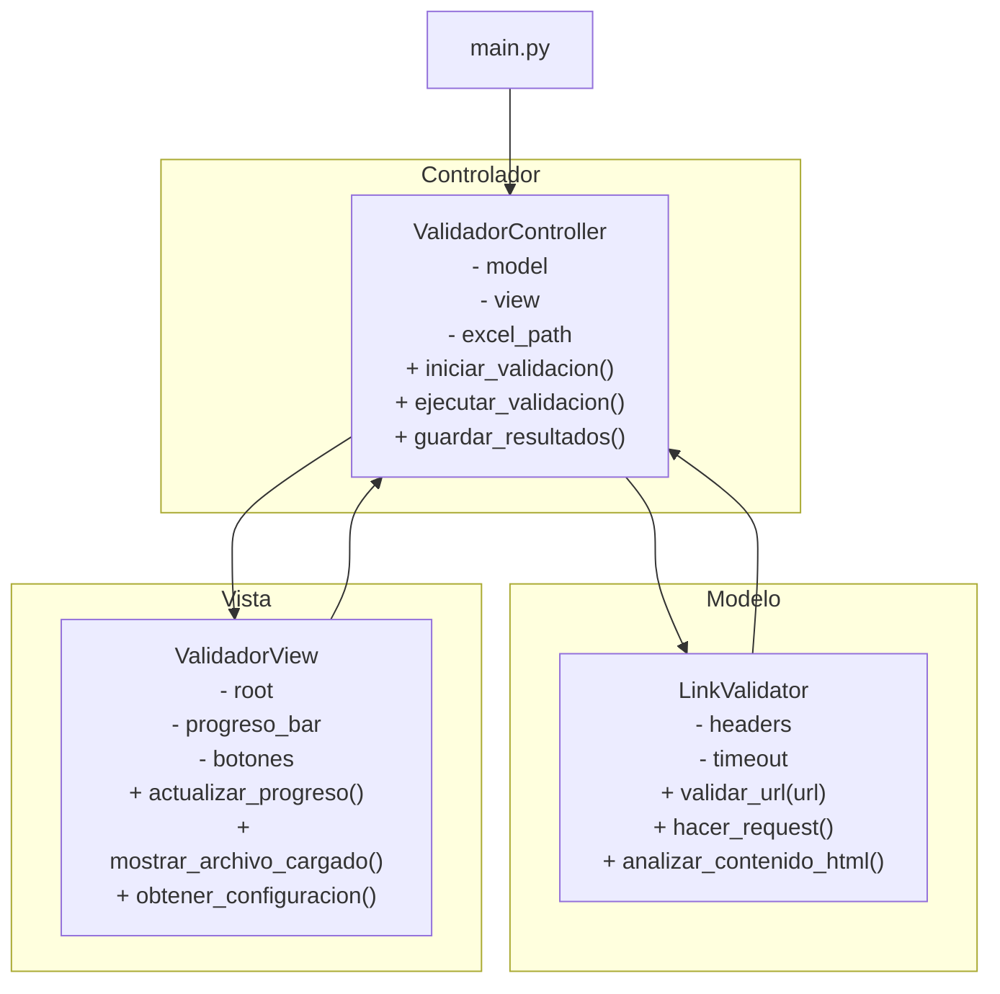
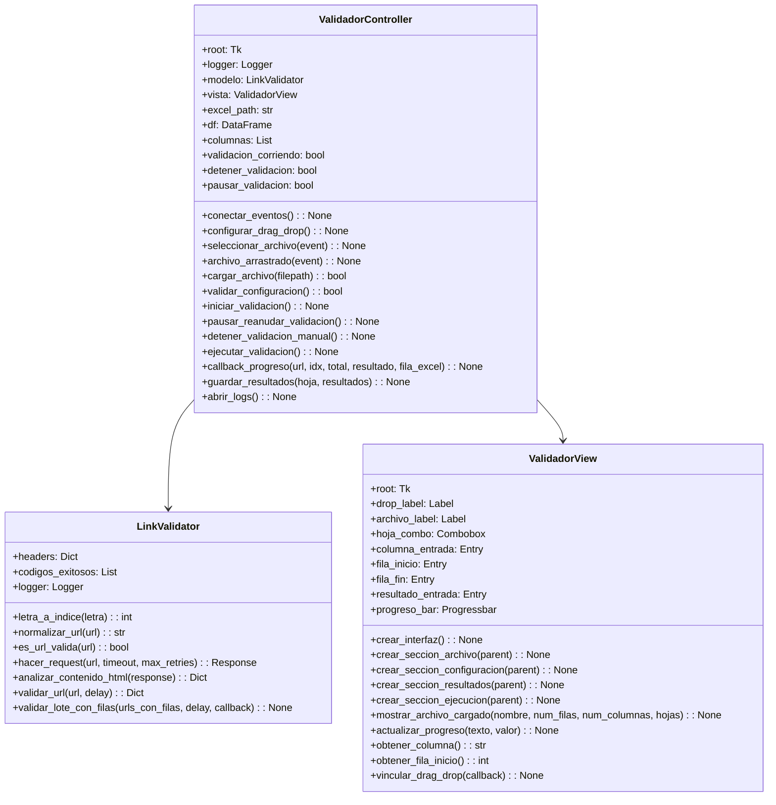

# Manual Técnico - Validador de Enlaces en Excel

Esta aplicación está desarrollada en Python siguiendo el patrón de arquitectura **Modelo-Vista-Controlador (MVC)** para garantizar una separación clara de responsabilidades, facilidad de mantenimiento y escalabilidad. Utiliza `tkinter` para la interfaz gráfica y librerías robustas como `pandas`, `requests` y `beautifulsoup4` para el procesamiento de datos y validación web.

### Arquitectura MVC

La aplicación se estructura en tres capas principales:

- **Modelo (`model/link_validator.py`)**: Contiene la lógica de negocio pura. Se encarga de la validación de URLs, normalización, peticiones HTTP y análisis de contenido HTML. No tiene conocimiento de la interfaz gráfica.
- **Vista (`view/validador_view.py`)**: Gestiona la interfaz de usuario (GUI). Se encarga de mostrar ventanas, botones, barras de progreso y recibir la entrada del usuario. No contiene lógica de negocio.
- **Controlador (`controller/validator_Controller.py`)**: Actúa como intermediario. Recibe eventos de la Vista (clics), invoca la lógica del Modelo y actualiza la Vista con los resultados. Gestiona el flujo de ejecución y los hilos (threading).

### Componentes Principales

- **Interfaz Gráfica**: Construida con `tkinter` y `ttk`. Implementa Drag & Drop mediante `tkinterdnd2`.
- **Procesamiento de Datos**: Utiliza `pandas` para la lectura eficiente de archivos Excel y `openpyxl` para la escritura de resultados manteniendo el formato del archivo original.
- **Validación Web**: Emplea `requests` para las conexiones HTTP y `BeautifulSoup` para el análisis semántico del contenido HTML (detección de errores 404 suaves, logins, etc.).
- **Concurrencia**: Utiliza el módulo `threading` para ejecutar el proceso de validación en segundo plano, evitando que la interfaz se congele durante operaciones de red intensivas.
- **Logging y Errores**: Sistema centralizado de logs (`utils/logger.py`) con patrón Singleton y manejo de errores estandarizado (`utils/errors.py`).

### Clases Principales

#### LinkValidator (Modelo)
Encapsula la lógica de validación de enlaces.
- **Métodos clave**:
  - `validar_url(url)`: Orquesta el flujo de validación de una URL individual.
  - `hacer_request(url)`: Maneja la conexión HTTP con reintentos y timeout.
  - `analizar_contenido_html(response)`: Busca palabras clave de error en el HTML.
  - `normalizar_url(url)`: Corrige formatos de URL incompletos.

#### ValidadorView (Vista)
Clase responsable de la presentación visual.
- **Componentes**: Panel de carga (Drag & Drop), configuración de columnas/filas, panel de control y barra de progreso.
- **Métodos clave**: `actualizar_progreso()`, `mostrar_archivo_cargado()`, `vincular_eventos()`.

#### ValidadorController (Controlador)
Coordina la aplicación.
- **Responsabilidades**: Carga de archivos, validación de configuración, gestión del hilo de ejecución, pausa/reanudación y guardado de resultados.
- **Métodos clave**: `iniciar_validacion()`, `ejecutar_validacion()` (corre en hilo), `guardar_resultados()`.

### Diagrama de Arquitectura MVC



### Diagrama de Clases



### Flujo de Procesamiento

1.  **Carga**: El usuario selecciona un archivo. El Controlador usa Pandas para leer la estructura y la Vista muestra los metadatos.
2.  **Configuración**: El usuario define columnas y rangos. El Controlador valida estos datos antes de iniciar.
3.  **Ejecución (Threading)**:
    - Se lanza un hilo secundario para no bloquear la UI.
    - Se itera sobre las filas seleccionadas.
    - **Pre-validación**: Se normaliza la URL y se verifica sintaxis.
    - **Conexión**: Se intenta conectar (HTTP/HTTPS). Se manejan errores SSL y Timeouts.
    - **Análisis**: Si hay respuesta, se analiza el código de estado y el contenido HTML buscando "falsos positivos" (ej. páginas de parking).
4.  **Feedback**: Mediante callbacks, se actualiza la barra de progreso en la Vista en tiempo real.
5.  **Persistencia**: Al finalizar (o al detener), se usa `openpyxl` para escribir los estados ("VÁLIDO", "NO VÁLIDO", "VALIDAR") en la columna de resultados del archivo Excel original.

### Consideraciones Técnicas

-   **Patrón Singleton**: Implementado en `Logger` para garantizar un único punto de acceso al archivo de logs desde cualquier parte de la aplicación.
-   **Manejo de Excepciones**: Uso de una clase `MensajesError` estática para centralizar los textos y formatos de error, facilitando la consistencia entre logs y popups.
-   **Compatibilidad**: Detección automática del sistema operativo (Windows/Mac/Linux) para la apertura de archivos de log y gestión de rutas.
-   **Configuración**: Todas las constantes (colores, timeouts, headers, emojis) están separadas en `config/constants.py` para facilitar cambios sin tocar el código lógico.

### Estructura de Archivos

```
Validador/
├── main.py                   # Punto de entrada
├── requirements.txt          # Dependencias
├── config/
│   └── constants.py          # Configuración global
├── controller/
│   └── validator_Controller.py
├── model/
│   └── link_validator.py     # Lógica de validación
├── view/
│   └── validador_view.py     # Interfaz gráfica
└── utils/
    ├── errors.py             # Manejo de errores
    └── logger.py             # Sistema de logs
```
